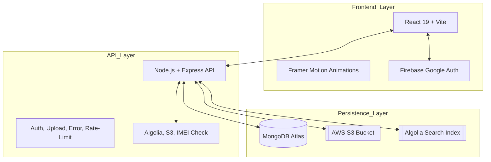
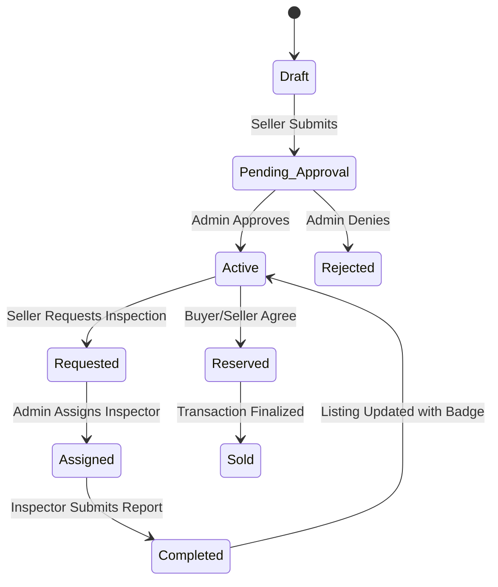

# 📱 TrustiFi: The Ultimate Trust-Driven Smartphone Marketplace

TrustiFi is a revolutionary peer-to-peer marketplace designed to eliminate fraud and uncertainty in the second-hand smartphone industry. By combining professional physical inspections, real-time IMEI verification, and a robust admin moderation ecosystem, TrustiFi transforms a high-risk transaction into a safe, verified experience.

---

## 🌍 1. Project Vision & Impact

In the current circular economy, thousands of smartphones are traded daily. However, buyers face significant risks: blacklisted IMEIs, replaced non-original parts, and hidden hardware failures. Sellers face low trust and unfair pricing.

**TrustiFi solves this by:**
- **Standardizing Trust**: Providing a "Trust Score" and "Grade" (A+ to F) for devices.
- **Environmental Impact**: Extending the lifecycle of electronics by making "pre-owned" as reliable as "new."
- **Transparency**: Every listing includes a detailed inspection report visible to the buyer.

---

## 🏗️ 2. Architectural Deep-Dive

### **System Architecture Diagram**


### **Core Data Flows**
1.  **Asynchronous Search Indexing**: We utilize Mongoose middleware (`post-save` hooks) to keep our **Algolia** search index in sync with our **MongoDB** source of truth. This ensures search results are always accurate without adding latency to the user's write requests.
2.  **Streaming Media Pipeline**: Using **Multer-S3**, images uploaded by sellers are streamed directly to **AWS S3**. The backend never stores files locally, ensuring the application remains stateless and horizontally scalable.
3.  **Geospatial Discovery**: Listings use **GeoJSON** points. The backend leverages MongoDB's `$near` and `$geoWithin` operators to find listings relative to a user's latitude and longitude.

---

## 🛡️ 3. The Trust Engine (Inspection & Scoring)

### **State Machine: Listing Lifecycle**


### **Trust Score Calculation Logic**
The backend calculates a weighted score (0-100) based on four technical pillars:
- **IMEI Status (25%)**: Verification against global blacklists and network locks.
- **Hardware Health (25%)**: Screen condition, body integrity, and functional ports/buttons.
- **Battery Performance (25%)**: Capacity percentage, cycle count, and original vs. third-party replacement.
- **Parts Authenticity (25%)**: Verification of original screen, motherboard, and camera modules.

---

## 🛠️ 4. Comprehensive Tech Stack & Why?

### **Frontend (The "Experience" Layer)**
- **React 19**: Latest stable version, leveraging improved performance and component architecture.
- **Vite 8**: Chosen for its lightning-fast development server and optimized build pipeline.
- **Framer Motion**: Used for premium micro-interactions (e.g., fluid page transitions and hover effects) to give the app a "premium" feel.
- **Tailwind CSS**: Utility-first styling for rapid, responsive UI development.
- **React Router 7**: Manages complex dashboard layouts for four distinct user roles.
- **Firebase Auth**: Provides a secure, scalable Google Authentication flow without complex backend boilerplate.

### **Backend (The "Engine" Layer)**
- **Node.js & Express**: Event-driven, non-blocking I/O ideal for a marketplace with high concurrent users.
- **MongoDB Atlas**: Scalable NoSQL database with native support for GeoJSON and complex nested documents.
- **Algolia Search**: Third-party search-as-a-service providing sub-100ms autocomplete and typo-tolerance.
- **AWS S3**: The industry standard for durable, distributed object storage.
- **JWT (JSON Web Tokens)**: Used for stateless authentication across the API.

---

## 🌐 5. API Reference & Controller Logic

### **Core Controllers**
- **authController.js**: Handles Google Login integration, session management, and role-based token generation.
- **listingController.js**: Complex logic for geospatial queries, view incrementing, and offer management.
- **inspectionController.js**: Manages the assignment of jobs to inspectors and the calculation of device health scores.
- **chatController.js**: Powers the real-time (polling-based/stateful) communication between buyers and sellers.

### **Key Endpoints**
| Method | Endpoint | Access | Description |
| :--- | :--- | :--- | :--- |
| `POST` | `/api/auth/google-basic` | Public | Exchange Google profile for JWT. |
| `GET` | `/api/listings` | Public | Browse with geo-filters and brand search. |
| `POST` | `/api/listings` | Seller | Multi-part upload for new device ads. |
| `POST` | `/api/inspections/submit/:id` | Inspector | Technical data submission for devices. |
| `PATCH` | `/api/admin/approve/:id` | Admin | Review and publish pending listings. |

---

## 🛡️ 6. Security & Performance Optimization

- **Role-Based Access Control (RBAC)**: Custom middleware (`protect`, `adminOnly`, `inspectorOnly`) ensures that a Buyer cannot access an Inspector's dashboard.
- **Rate Limiting**: Implemented via `express-rate-limit` to prevent brute-force attacks and API abuse.
- **Data Sanitization**: Using `helmet.js` and custom validators to prevent NoSQL injection and XSS attacks.
- **Performance**:
    - **Indexing**: MongoDB indexes on `geo`, `price`, `brand`, and `status`.
    - **Debouncing**: Frontend search inputs are debounced to reduce unnecessary API calls.
    - **Lazy Loading**: Images and heavy components are lazy-loaded to improve Initial Page Load (LCP).

---

## 📁 7. Full File Structure Breakdown

### **Root**
- `README.md`: The document you are reading.
- `package.json`: Project-wide dependencies.

### **Backend (`/backend`)**
- `/config`: Database and service configurations (AWS, Algolia).
- `/controllers`: The core business logic for each resource.
- `/middleware`: Auth verification, image upload (Multer-S3), and global error handlers.
- `/models`: Mongoose schemas (Listing, User, InspectionReport, Chat, Notification).
- `/routes`: Defined API paths and their associated controllers/middleware.
- `/services`: Abstraction layer for third-party APIs (Algolia SDK, S3 Utils).
- `/utils`: Helper functions (IMEI checks, data formatting).
- `server.js`: Entry point for the Express application.

### **Frontend (`/frontend`)**
- `/src/assets`: Static images and global styles.
- `/src/components`: Atomic UI components (Navbar, Badge, ListingCard).
- `/src/context`: React Context for Auth and Global State.
- `/src/pages`: Feature pages (Home, Browse, Auth).
- `/src/pages/dashboards`: Role-specific management views.
- `/src/services`: Frontend API wrappers using Axios.
- `App.jsx`: Main routing and layout wrapper.
- `main.jsx`: Application entry point.

---

## 🚀 8. Interview Preparation: High-Impact Scenarios

### **Scenario: "How do you handle large image uploads?"**
*"We use Multer-S3. Instead of saving files to the server's local disk (which would fail on platforms like Heroku/Vercel and wouldn't scale), we stream the file buffer directly to an AWS S3 bucket. This keeps our backend stateless."*

### **Scenario: "What happens if Algolia goes down?"**
*"Our architecture uses MongoDB as the primary source of truth. The search results in the app have a fallback mechanism that queries the MongoDB `$text` index if the Algolia service returns an error, ensuring zero downtime for the user."*

### **Scenario: "How do you ensure the Trust Score is fair?"**
*"The score is calculated based on a weighted algorithm in the backend. It's not subjective; it's data-driven based on specific inputs like Battery Cycle Count and IMEI Blacklist status. Admins can override it only with a valid reason, which is logged for transparency."*

---

## 📥 9. Setup & Development

### **Environment Variables**
Ensure both `.env` files are populated (refer to Section 5 for keys).

### **Installation Commands**
```bash
# Install dependencies
npm run install-all

# Seed the database with demo listings
cd backend && npm run seed

# Start the full stack in development mode
npm run dev
```

---

## 🔮 10. Future Roadmap

- **Socket.io Integration**: Moving from polling to real-time WebSockets for the chat system.
- **PWA (Progressive Web App)**: Enabling offline access and push notifications for mobile users.
- **Stripe Integration**: Facilitating secure payments through an escrow-like system.

---

*Designed for transparency. Engineered for trust. Built for the future of trade.*
